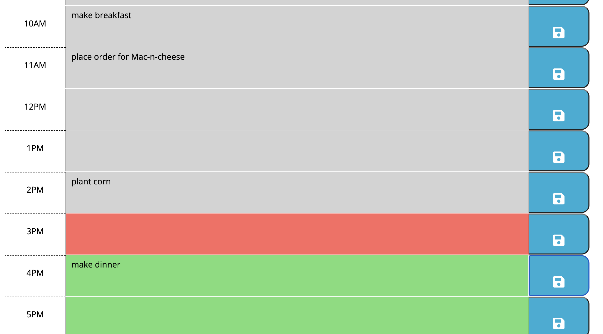

# Project Name - Personal Workday Scheduler

## Table of contents

- [Overview](#overview)
  - [The challenge](#the-challenge)
  - [User Story](#user-story)
  - [Acceptance Criteria](#acceptance-criteria)
  - [Screenshot](#screenshot)
  - [Links](#links)
- [My process](#my-process)
  - [Built with](#built-with)
  - [What I learned](#what-i-learned)
- [Author](#author)
- [Acknowledgments](#acknowledgments)


## Overview
The Personal Workday Scheduler is a simple calendar application that allows a user to save events for each hour of the day. This app will run in the browser and feature dynamically updated HTML and CSS powered by jQuery.

### The challenge

The Personal Workday Scheduler runs in the browser, and features dynamically updated HTML and CSS powered by JavaScript. The Scheduler has a clean and polished user interface that is responsive, ensuring that it adapts to multiple screen sizes.

### User Story

AS AN employee with a busy schedule
I WANT to add important events to a daily planner
SO THAT I can manage my time effectively

### Acceptance Criteria

GIVEN I am using a daily planner to create a schedule
WHEN I open the planner
THEN the current day is displayed at the top of the calendar
WHEN I scroll down
THEN I am presented with time blocks for standard business hours
WHEN I view the time blocks for that day
THEN each time block is color-coded to indicate whether it is in the past, present, or future
WHEN I click into a time block
THEN I can enter an event
WHEN I click the save button for that time block
THEN the text for that event is saved in local storage
WHEN I refresh the page
THEN the saved events persist

### Screenshot





### Links

- Solution URL: [GitHub Repository](https://github.com/NaNifer/Personal-Workday-Scheduler-h5)
- Live Site URL: [Personal Workday Scheduler](https://nanifer.github.io/Personal-Workday-Scheduler-h5/)


## My process

I first broke the problem down into smaller sections of code. HTML and CSS was first, I worked with what was prewritten, modifying it, and adding icons with fontawesome.

Next I focused on using the JS to modify the formatting. I was at first trying an overly complicated approach to target each of the HTML elements for the formatting. After a session with a tutor, I realized the my approach was more complicated than it needed to be, and there was a simple way to do the formatting without having to get each individual html element. 

That was a little bit of a lightbulb moment, which then I later applied to saving the data in local storage. Finally, when it was all finished and working correctly, I added the extra feature of being able to clear the work scheduler of it's data with a click of a button.


### Built with

- Semantic HTML5 markup
- CSS
- Javascript
- jQuery
- Bootstrap

### What I learned

As mentioned above, instead of writing a line of code for each targeted html element, I woeked with my tutor to create a function that would target the button's siblings each time any button was clicked. This was definitely a learning moment for me, and process that I need to remember and internalize as I continue to gain expereience in coding.

Example:

```js
$('.saveBtn').on("click", function (event) {
    console.log(event);
    var keyName = $(this).siblings('.entryHere').attr('id');
    var textValue = $(this).siblings('.entryHere').val();
    localStorage.setItem(keyName, textValue);
})
```

## Author

- GitHub - [NaNifer](https://github.com/NaNifer)
- Portfolio - [Nifer Kilakila](https://nanifer.github.io/Nifer-Kilakila-Portfolio-h2/)


## Acknowledgments

A huge shout out to [nullaus](https://github.com/nullaus) who was my quick dial on all the random questions about JS, and taught me that the arguments of functions could call on variables inside of other functions.

Huge thanks to my tutor and TA's, that helped demonstrate more elegant and concise way to target HTML elelments in JS.

Many thanks to my classmates Nolan, Angie, and Ivy for being such great folks for collaborating on solving problems with each other's code. 